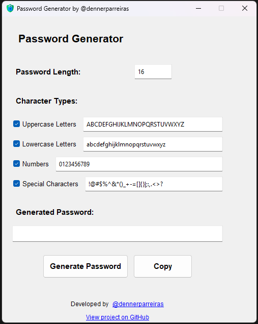

# Password Generator

A simple and efficient password generator with a graphical user interface built with Python and Tkinter. This project is part of my (Denner Parreiras) Python learning journey.




## About The Project

This Password Generator was created to provide a simple yet powerful way to generate secure passwords. The project features a clean graphical interface that makes it easy to:

- Generate secure random passwords
- Customize password length and character types
- Copy passwords to clipboard with one click
- View and customize the character sets used for generation

The project serves as a practical application of Python programming concepts, including:

- GUI development with Tkinter
- Object-oriented programming
- File handling
- Event handling
- Package management


## Features

- Generate secure passwords with configurable length
- Choose which character types to include:
  - Uppercase letters
  - Lowercase letters
  - Numbers
  - Special characters
- Customize the character set for each type
- Copy generated password to clipboard
- Clean and intuitive graphical interface
- Default password length of 16 characters


## Installation

1. Clone the repository:

```bash
git clone https://github.com/dennerparreiras/python-password-generator.git
```


2. Navigate to the project directory:

```bash
cd python-password-generator
```

3. Install required dependencies:

```bash
pip install -r requirements.txt
```


## Usage

### Running from Source

Run the program directly with Python:

```bash
python password_generator.py
```

### Running the Executable

1. Build the executable:

```bash
python build.py
```

2. Find the executable in the `dist` folder and run it.


## Project Structure

```
python-password-generator/
│
├── password_generator.py    # Main application file
├── build.py                # Script to build executable
├── create_icon.py          # Icon generation script
├── password_icon.ico       # Application icon
├── version.txt            # Version information
├── requirements.txt       # Project dependencies
└── README.md             # Project documentation
```


## Development

The project is structured using object-oriented programming principles:

- `PasswordGeneratorGUI` class handles the graphical interface
- Password generation logic is encapsulated in dedicated methods
- Error handling ensures robust operation
- Clean code practices and comprehensive commenting


## Contributing

1. Fork the project
2. Create your feature branch (`git checkout -b feature/AmazingFeature`)
3. Commit your changes (`git commit -m 'Add some AmazingFeature'`)
4. Push to the branch (`git push origin feature/AmazingFeature`)
5. Open a Pull Request


## License

Distributed under the MIT License. See below for more information.

```
MIT License

Copyright (c) 2024 Denner Parreiras

Permission is hereby granted, free of charge, to any person obtaining a copy
of this software and associated documentation files (the "Software"), to deal
in the Software without restriction, including without limitation the rights
to use, copy, modify, merge, publish, distribute, sublicense, and/or sell
copies of the Software, and to permit persons to whom the Software is
furnished to do so, subject to the following conditions:

The above copyright notice and this permission notice shall be included in all
copies or substantial portions of the Software.

THE SOFTWARE IS PROVIDED "AS IS", WITHOUT WARRANTY OF ANY KIND, EXPRESS OR
IMPLIED, INCLUDING BUT NOT LIMITED TO THE WARRANTIES OF MERCHANTABILITY,
FITNESS FOR A PARTICULAR PURPOSE AND NONINFRINGEMENT. IN NO EVENT SHALL THE
AUTHORS OR COPYRIGHT HOLDERS BE LIABLE FOR ANY CLAIM, DAMAGES OR OTHER
LIABILITY, WHETHER IN AN ACTION OF CONTRACT, TORT OR OTHERWISE, ARISING FROM,
OUT OF OR IN CONNECTION WITH THE SOFTWARE OR THE USE OR OTHER DEALINGS IN THE
SOFTWARE.
```


## Contact

Denner Parreiras - [@dennerparreiras](https://github.com/dennerparreiras)

Project Link: [https://github.com/dennerparreiras/python-password-generator](https://github.com/dennerparreiras/python-password-generator)
